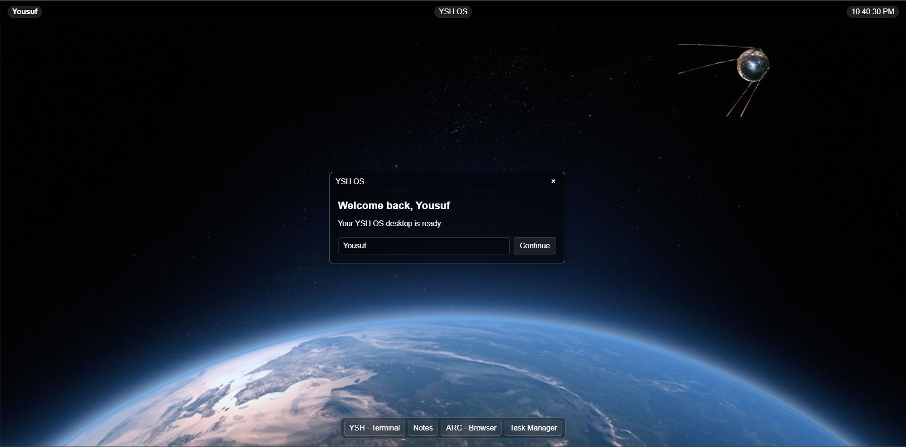
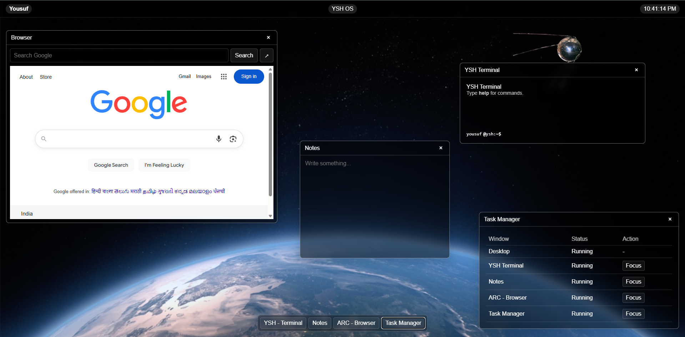

# YSH OS Web  [Try YSH OS](https://yousufprojs-exe.github.io/YSH-OS-Web/)

YSH OS, but running in a browser.

This is my attempt at building a small web-based operating system using plain HTML, CSS and JavaScript.

It started as a simple desktop experiment and grew into a usable little environment with movable windows and a few basic apps.

## What it has

- Desktop 
- Live clock 
- Draggable windows 
- YSH Terminal 
- Notes 
- ARC Browser 
- Task Manager 
- User name 

## Terminal 

text
help
clear
date
time
whoami
ver
about
echo 

## Built with

HTML
CSS
JavaScript

## Status

WebOS 1 — Done.
WebOS 2 will have the deeper system stuff. [ actual YSH maybe ]

Built by Yousuf.
